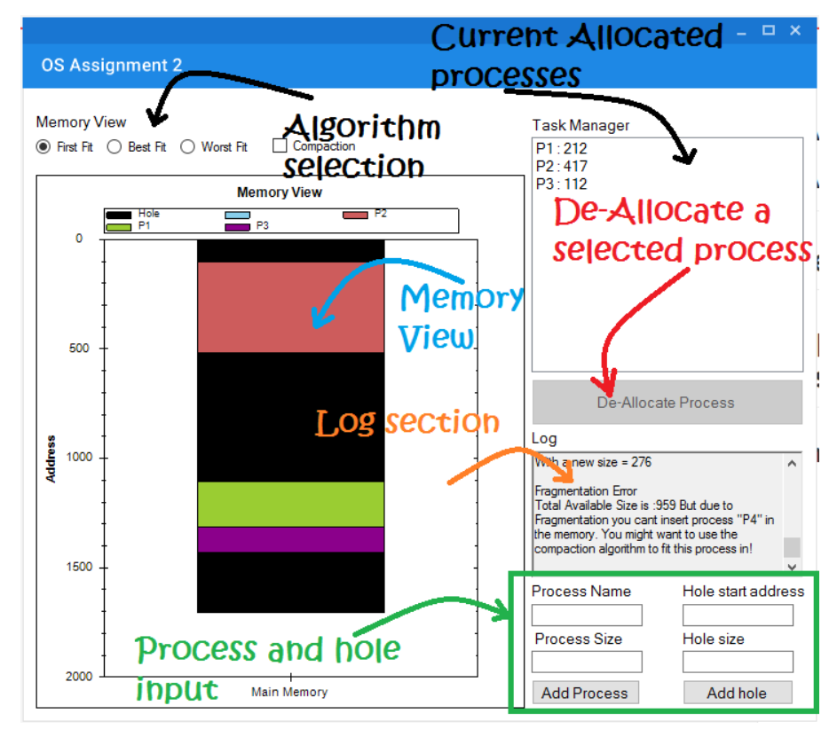
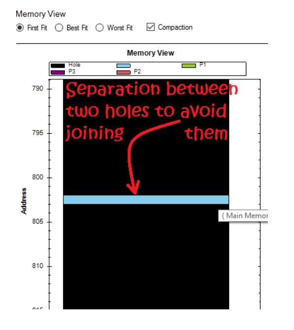
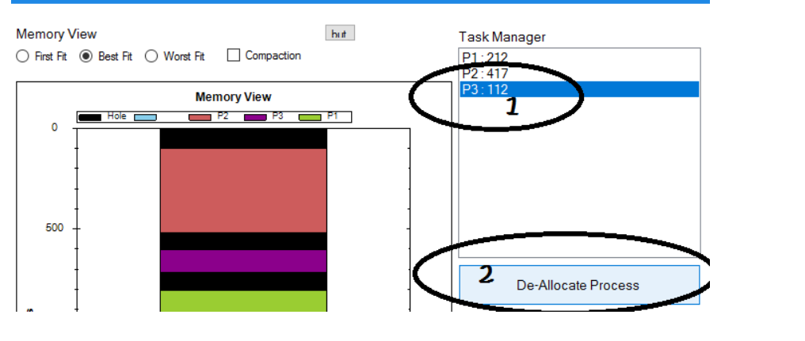
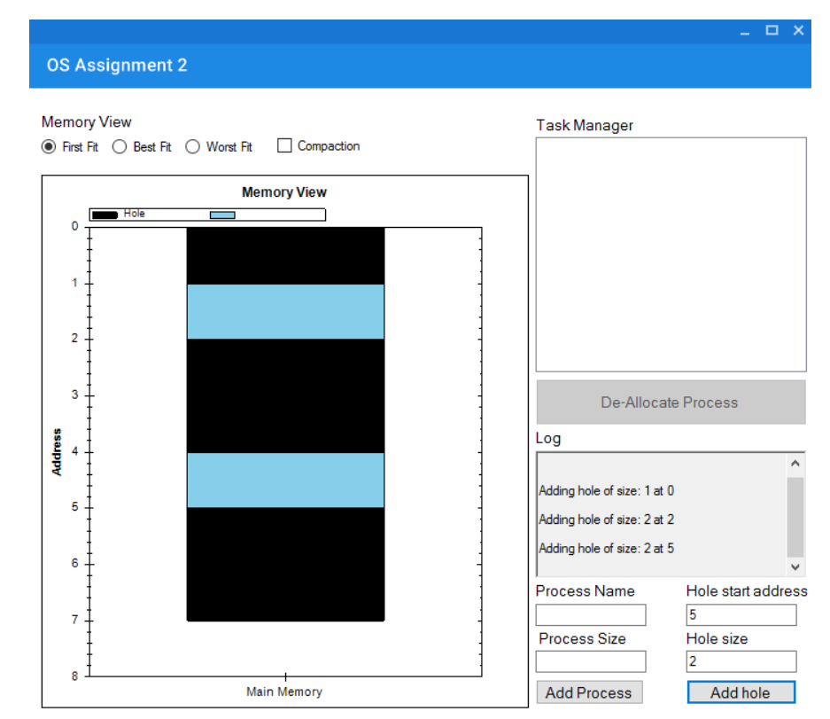
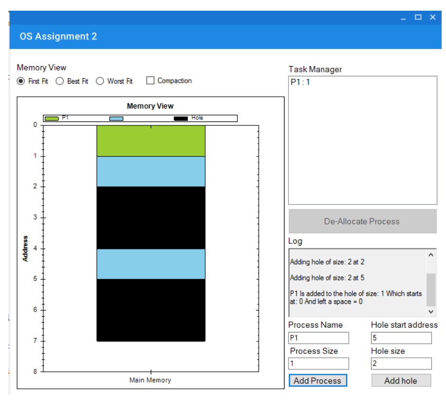
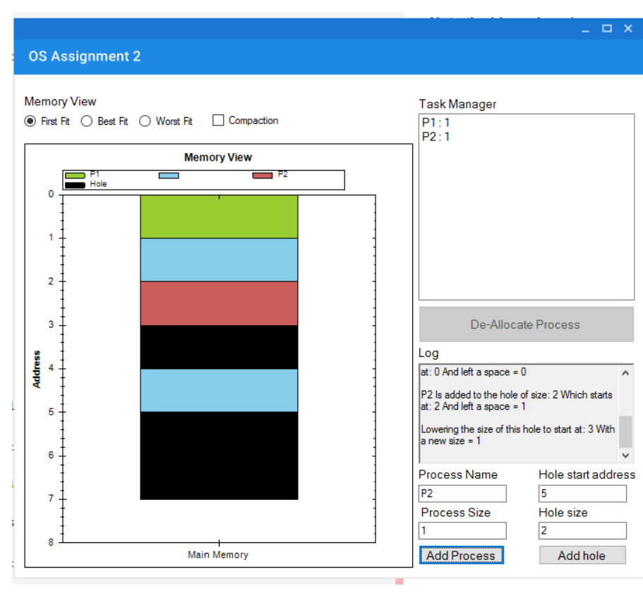
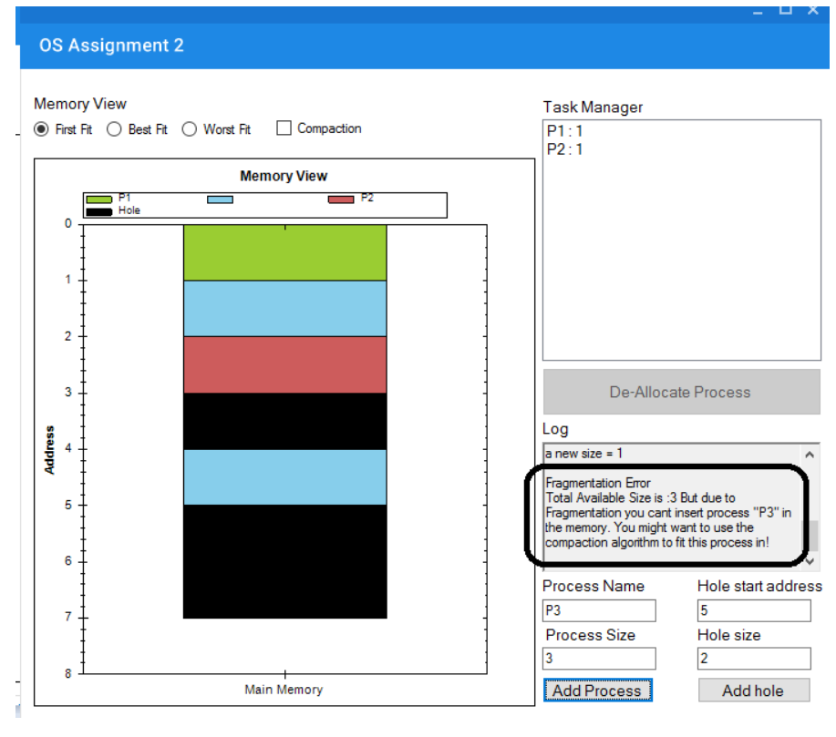

## Operating Systems Memory Allocation Assignment

### Implementation details
* The software implements **ALL THE ALLOCATION ALGORITHMS**. This includes the **First-Fit**, **Best-Fit**, **Worst-Fit** with and without **Compaction**
* The software supports **De-Allocation**
* The software supports **LIVE SIMULATION** where the user can allocate memory to a process or de-allocate memory from a process at any time.
* The **Log** section shows every single detail in the allocation process and gives very clear info about the current memory location that is being allocated to a process, or the current hole that is being expanded. Also the software tells if the **Compaction Algorithm** should be used.
* The software implements two different classes, `MemoryLocation`, `MemoryContainer`.
* The software shows informative messages when wrong inputs are entered and allows you to fix them.

### Software Snapshot

## How to use
* The only way to enter all the processes is to **ENTER EACH OF THEM ONE BY ONE** since the software does a **live simulation**, the current memory will be updated **Instantly** to view where this process is allocated, also the **log** will tell at which hole this process was added.

* The software assumes a separation between two holes when they are not neighbours, this is to avoid joining them into a single hole, the separating distance **is not allowed to be used for process allocation**.   

* To De-allocate a proceess, just select it from the task manager list on the right and then press the de-allocate button  

#### Example

##### Test case 1: First-Fit without compaction

**Holes**

Start address | Size
--- | ---
0 | 1
2 | 2
5 | 2

**Processes**

Name | Size
--- | ---
P1 | 1
P2 | 1
P3 | 3

After adding all the holes

**Note the blue reigon is assumed to be allocated to some other processes**

Now after adding process **P1**

After adding process **P2**

When trying to add process **P3** it will not be added, since the only available holes are a hole of size **1** at **Memory[3]** and a hole of size **2** at **Memory[5]**.

As the note indicated, eventhough their is a space to fit **P3** in, we cant insert it due to the fragmentation, the **Log screen** suggests using the compaction algorithm, I will repeat the same steps but this time the **Compaction CheckBox** will be checked.

Note

The software **Log section** shows that the process **P4** can't be inserted, in order to insert it we need to select the compaction mode
