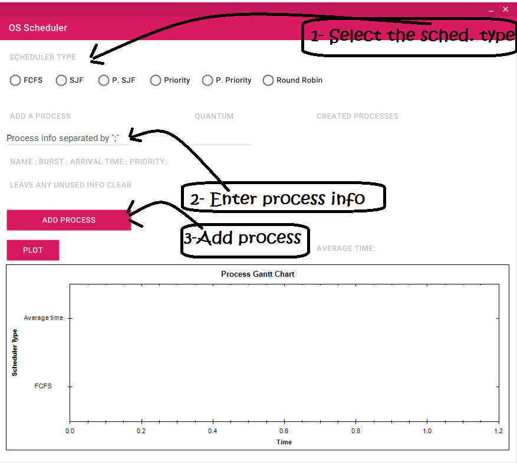
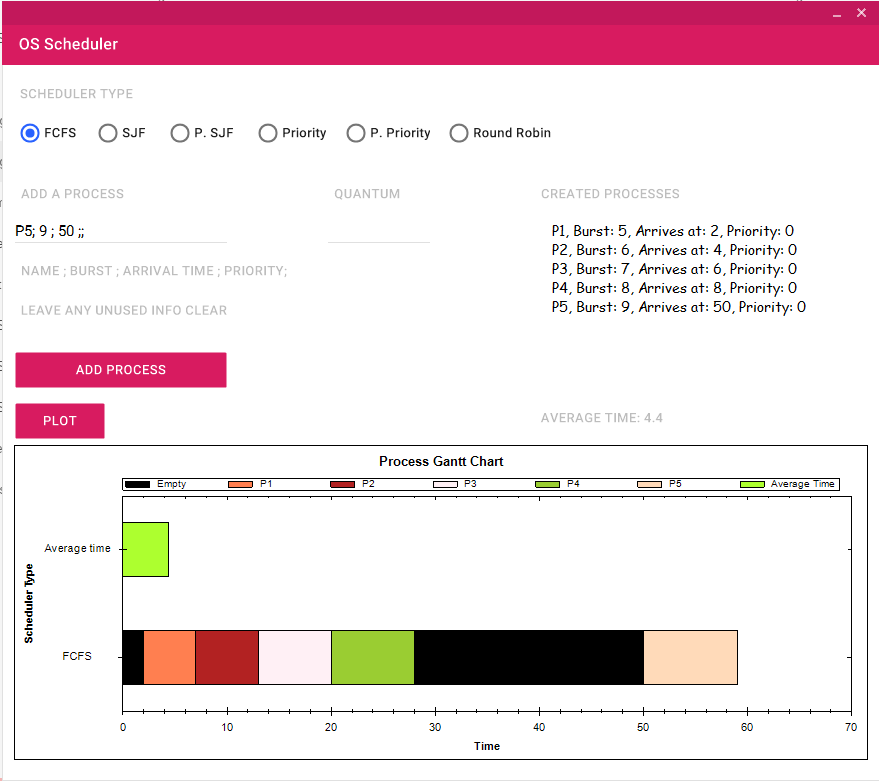
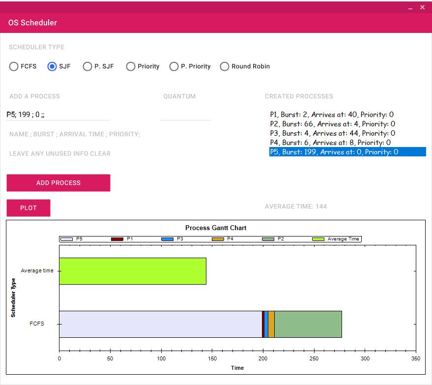
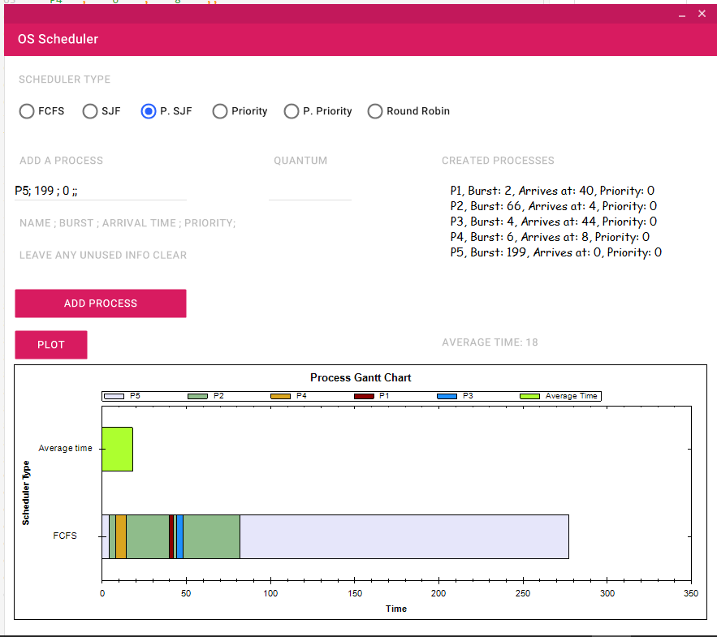
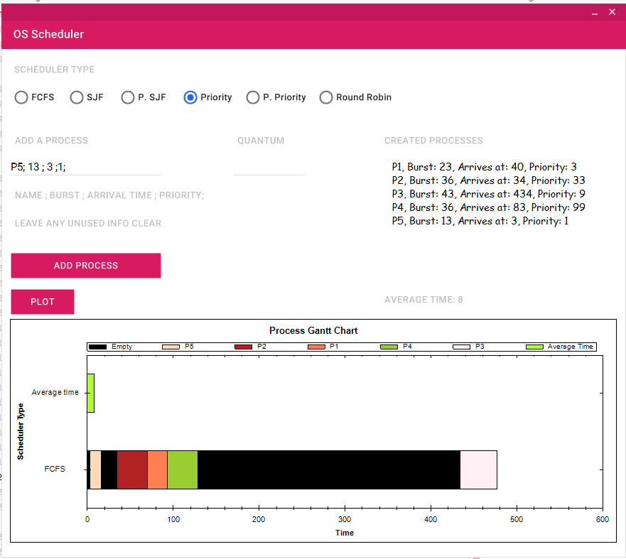
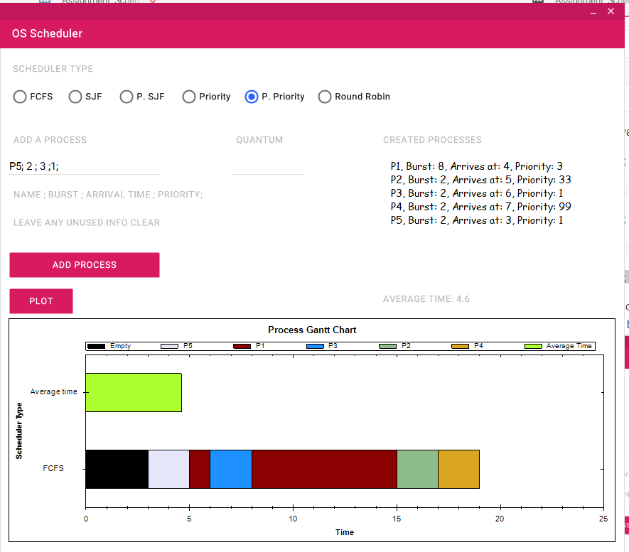
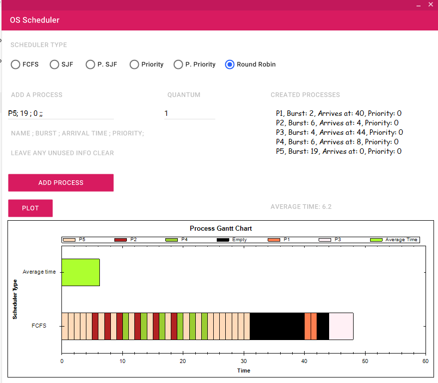

## Operating Systems Scheduler Assignment [Supports all the scheduling algorithms]

### How to use the software

* First the user need to choose the proper scheduling algorithm
* Then the user should add the process via the text label. In the following order   `Process name`**;** `Burst time` **;** `Arrival time` **;** `Priority`**;**
* In case one of the above input info. are not used, the user can just leave them by putting double semicolon. Example:    `Chrome`**;** `123` **;** `555` **;;**   in this example i have added a process named "Chrome" its Burst time is `123` and its arrival tile is `555` and **HAS NO PRIORITY**
___
 **Here are some examples**

 Using the **`FCFS`** scheduling algorithm i will add  the following processes

 Process Name | Burst | Arrival time
 ---|---|---
 P1 |   55 | 2
 P2 | 66 | 4
 P3 | 77 | 6
 P4 | 88 |8
 P5 | 99 |50

Telling the software these processes will be like the following

`P1`**;** `5` **;** `2` **;;**

`P2`**;** `6` **;** `4` **;;**

`P3`**;** `7` **;** `6` **;;**

`P4`**;** `8` **;** `8` **;;**

`P5`**;** `9` **;** `50` **;;**

And this is the software output with `Average waiting time = 4.4`

Using the **`SJF`** scheduling algorithm i will add  the following processes

Process Name | Burst | Arrival time
---|---|---
P1 |   2 | 40
P2 | 66 | 4
P3 | 4 | 44
P4 | 6 |8
P5 | 199 |0

Telling the software these processes will be like the following

`P1`**;** `2` **;** `40` **;;**

`P2`**;** `66` **;** `4` **;;**

`P3`**;** `4` **;** `44` **;;**

`P4`**;** `6` **;** `8` **;;**

`P5`**;** `199` **;** `0` **;;**

And this is the software output with `Average waiting time = 144`

Using the **`Pre emptive SJF`** scheduling algorithm i will add  the following processes

Process Name | Burst | Arrival time
---|---|---
P1 |   2 | 40
P2 | 66 | 4
P3 | 4 | 44
P4 | 6 |8
P5 | 199 |0

Telling the software these processes will be like the following

`P1`**;** `2` **;** `40` **;;**

`P2`**;** `66` **;** `4` **;;**

`P3`**;** `4` **;** `44` **;;**

`P4`**;** `6` **;** `8` **;;**

`P5`**;** `199` **;** `0` **;;**

And this is the software output with `Average waiting time = 18` .Much less than the previous algorithm

Using the **`Priority`** scheduling algorithm i will add  the following processes

Process Name | Burst | Arrival time |Priority
---|---|---|---
P1 | 23 | 40 |3
P2 | 36 | 34 |33
P3 | 43 | 434 |9
P4 | 36 | 83 |99
P5 | 13 | 3 |1

Telling the software these processes will be like the following

`P1`**;** `23` **;** `40` **;**`3`**;**

`P2`**;** `36` **;** `34` **;**`33`**;**

`P3`**;** `43` **;** `434` **;**`9`**;**

`P4`**;** `36` **;** `83` **;**`99`**;**

`P5`**;** `13` **;** `3` **;**`1`**;**

And this is the software output with `Average waiting time = 4` .And the CPU was idle during the gaps between the arrival times of the processes

Using the **`Preemptive Priority`** scheduling algorithm i will add  the following processes

Process Name | Burst | Arrival time |Priority
---|---|---|---
P1 | 8 | 4 |3
P2 | 2 | 5 |33
P3 | 2 | 6 |1
P4 | 2 | 7 |99
P5 | 2 | 3 |1

Telling the software these processes will be like the following

`P1`**;** `8` **;** `4` **;**`3`**;**

`P2`**;** `2` **;** `5` **;**`33`**;**

`P3`**;** `2` **;** `6` **;**`1`**;**

`P4`**;** `2` **;** `7` **;**`99`**;**

`P5`**;** `2` **;** `3` **;**`1`**;**

And this is the software output with `Average waiting time = 14.3` .And the CPU was idle during the gaps between the arrival times of the processes

Using the **`Round Robin`** scheduling algorithm with **`Q=1`** i will add  the following processes

Process Name | Burst | Arrival time
---|---|---
P1 |   2 | 40
P2 | 6 | 4
P3 | 4 | 44
P4 | 6 |8
P5 | 19 |0

Telling the software these processes will be like the following

`P1`**;** `2` **;** `40` **;;**

`P2`**;** `6` **;** `4` **;;**

`P3`**;** `4` **;** `44` **;;**

`P4`**;** `6` **;** `8` **;;**

`P5`**;** `19` **;** `0` **;;**

And this is the software output with `Average waiting time = 6.2`

